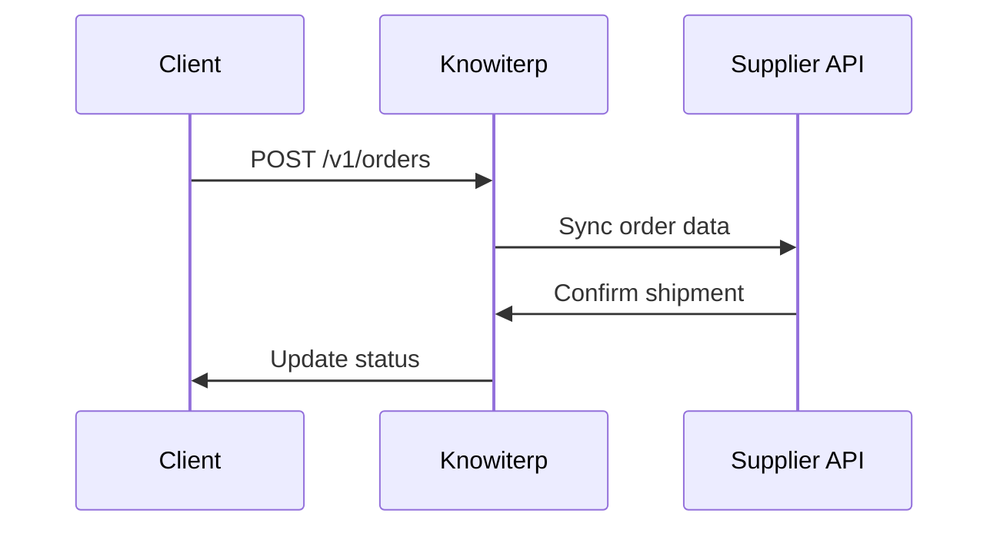

## Overview

Knowiterp provides flexible integration options to connect with external tools, streamlining your manufacturing workflows. Use the RESTful API for data exchange, webhooks for real-time updates, and pre-built connectors for popular services. These integrations help automate inventory sync, order processing, and financial reporting.

<Callout kind="tip">
Start with API keys from your Knowiterp dashboard at `https://dashboard.example.com/settings/api`.
</Callout>

## Common Integrations

Explore ready-to-use integrations tailored for manufacturing supply chains.

<Columns cols={3}>
  <Card title="Accounting Software" icon="dollar-sign" href="#accounting">
    Sync invoices and payments with QuickBooks or Xero.
  </Card>
  <Card title="Zapier" icon="zap" href="https://zapier.com" target="_blank">
    Connect 5000+ apps without coding.
  </Card>
  <Card title="Custom API" icon="code" href="#api">
    Build bespoke integrations for suppliers and ERP systems.
  </Card>
</Columns>

## Setting Up API Connections

Follow these steps to enable data exchange via Knowiterp's API.

<Steps>
  <Step title="Generate API Key" icon="key">
    Navigate to `https://dashboard.example.com/settings/api` and create a new key.
  </Step>
  <Step title="Authenticate Requests" icon="shield">
    Include the key in the `Authorization` header as `Bearer YOUR_API_KEY`.
  </Step>
  <Step title="Test Connection" icon="play">
    Fetch inventory data to verify setup.
  </Step>
</Steps>

<Request tabs="JavaScript,cURL" show-lines="true">
  ```javascript
  const response = await fetch('https://api.example.com/v1/inventory', {
    method: 'GET',
    headers: {
      'Authorization': 'Bearer YOUR_API_KEY',
      'Content-Type': 'application/json'
    }
  });
  const data = await response.json();
  console.log(data);
  ```

  ```bash
  curl -X GET 'https://api.example.com/v1/inventory' \
    -H 'Authorization: Bearer YOUR_API_KEY' \
    -H 'Content-Type: application/json'
  ```
</Request>

<Response tabs="200">
  ```json
  {
    "items": [
      {
        "id": "inv_001",
        "name": "TMT Bars",
        "quantity": 500,
        "unit_price": 45.50
      }
    ],
    "total": 1
  }
  ```
</Response>

<ParamField header="Authorization" param-type="string" required="true">
  Bearer token for authentication.
</ParamField>

<ParamField query="warehouse_id" param-type="string" required="false">
  Filter by specific warehouse.
</ParamField>

## Configuring Webhooks

Set up webhooks for real-time notifications on events like order updates or stock changes.

<Steps>
  <Step title="Create Webhook" icon="link">
    Go to `https://dashboard.example.com/settings/webhooks` and add your endpoint URL.
  </Step>
  <Step title="Select Events" icon="bell">
    Choose triggers such as `order.created` or `inventory.low`.
  </Step>
  <Step title="Verify Endpoint" icon="check-circle">
    Knowiterp sends a challenge payload; respond with `200 OK`.
  </Step>
</Steps>

Provide your public webhook URL, such as `https://your-webhook-url.com/webhook`.

## Accounting Software Integrations

Choose your preferred accounting tool and follow the setup.

<Tabs>
  <Tab title="QuickBooks" icon="dollar-sign">

    Use Knowiterp's QuickBooks connector to sync invoices automatically.

    <CodeGroup tabs="JavaScript,Python">
      ```javascript
      const QuickBooks = require('node-quickbooks');
      const qbo = new QuickBooks(/* config */);
      await qbo.createInvoice({
        CustomerRef: { value: 'customer_id' },
        Line: [{ Amount: 1000 }]
      });
      ```

      ```python
      import quickbooks
      client = quickbooks QuickBooks(/* config */)
      invoice = client.create_invoice({
          'CustomerRef': {'value': 'customer_id'},
          'Line': [{'Amount': 1000}]
      })
      ```
    </CodeGroup>

  </Tab>
  <Tab title="Xero" icon="shield">

    Map Xero contacts to Knowiterp customers for seamless data flow.

    <CodeGroup tabs="JavaScript">
      ```javascript
      const XeroClient = require('xero-node');
      const xero = new XeroClient({ /* config */ });
      const invoices = await xero.accounting.api.invoices.getInvoices();
      console.log(invoices);
      ```
    </CodeGroup>

  </Tab>
</Tabs>

## Best Practices

- Rotate API keys regularly for security.
- Use idempotency keys in requests to prevent duplicates.
- Test webhooks in sandbox mode first.

<Callout kind="alert">
Never expose API keys in client-side code or public repositories.
</Callout>

<Expandable title="Advanced: Custom Suppliers Integration">
For manufacturing supply chains, integrate with supplier APIs using the inventory endpoint.


</Expandable>